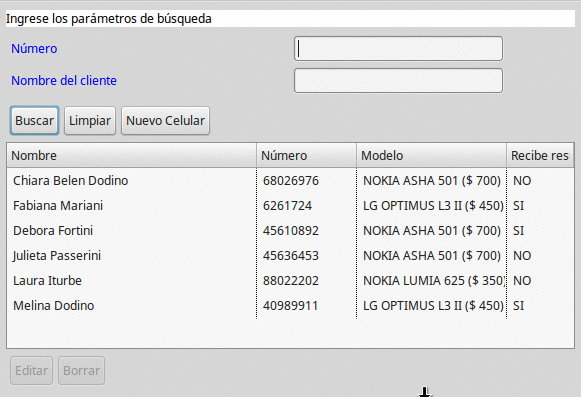

# Clientes de una compañía de Celulares - Arena Persistence

## Objetivo
Muestra cómo implementar una aplicación completa 

* La presentación está hecha en [Arena-UI](http://arena.uqbar-project.org/)
* Los objetos de dominio se persisten con [Arena-Persistence](http://arena-pers.uqbar.org/) dentro del raíz del proyecto/target/graphDB

## Enunciado

El enunciado completo está [aqui](https://sites.google.com/site/programacionui/material/ejemplos/dominios/clientes-de-una-empresa-de-celulares)

## Modelo

El modelo consiste en 

* el Celular, que representa un cliente de la compañía de celulares, que tiene número de celular, nombre y si recibe el resumen de cuenta en domicilio
 * además tiene un modelo de celular de su aparato (relación many-to-one)

